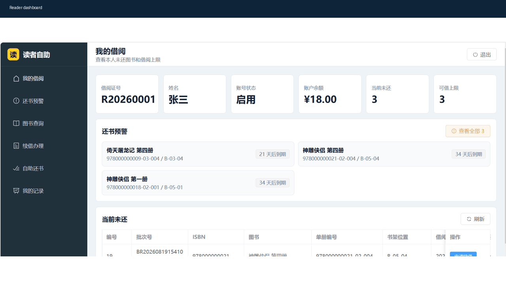
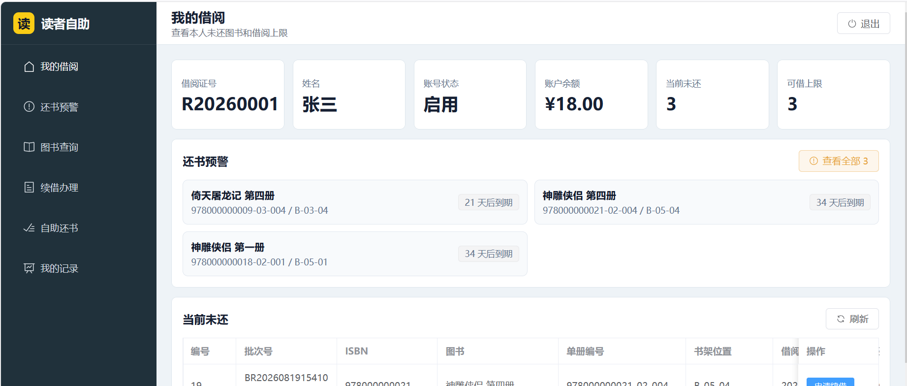
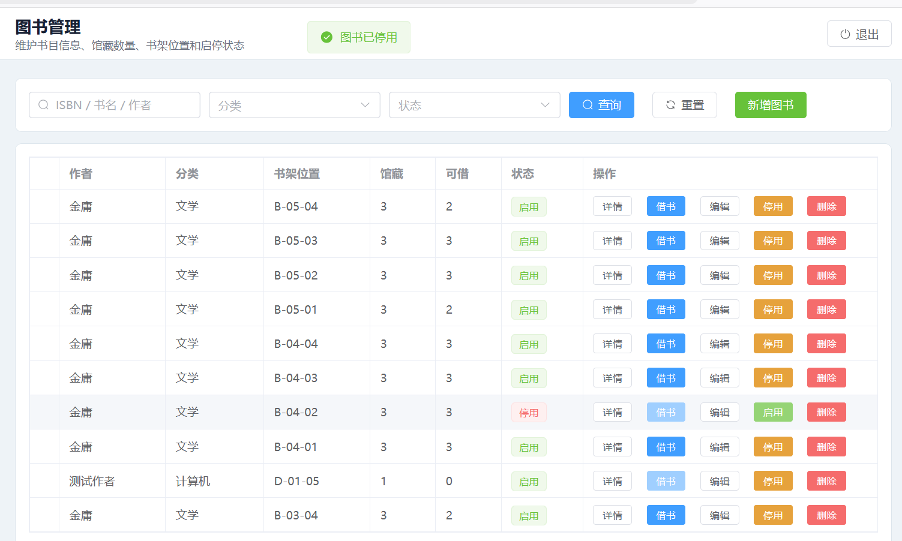
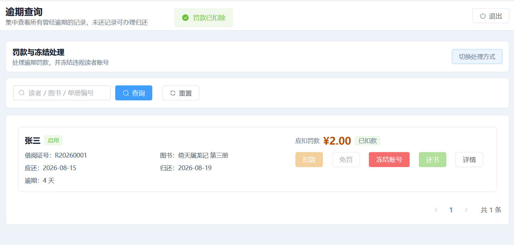
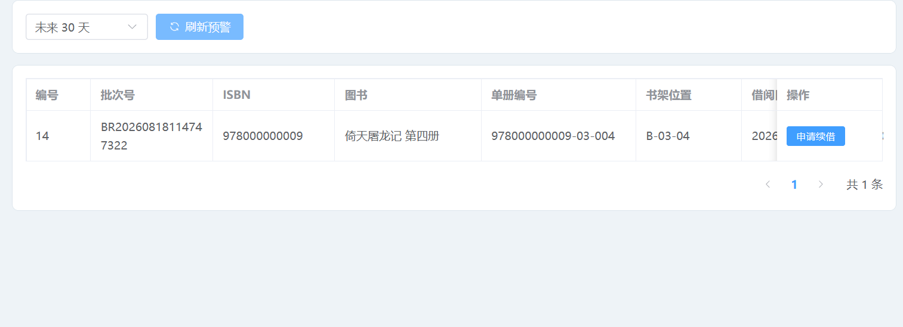
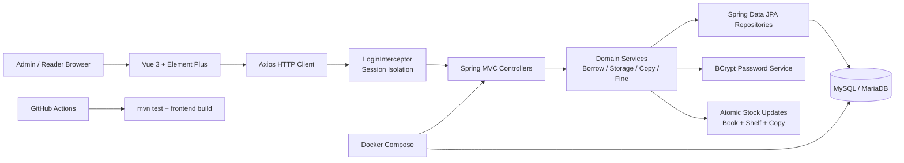
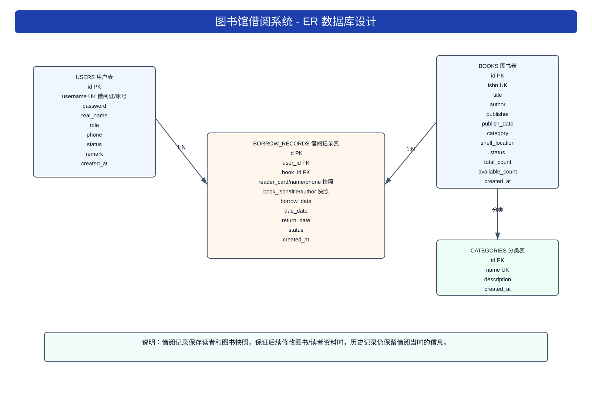
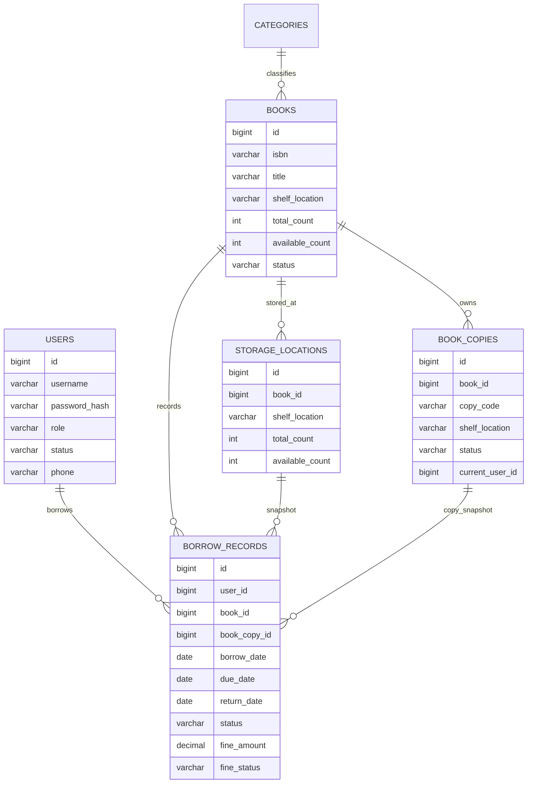

# 图书馆借阅管理系统 Library System

[](https://github.com/yangkangling/Project-LibrarySystem/actions/workflows/ci.yml)

一个基于 Spring Boot + Vue 3 的图书馆/资产流转管理系统，覆盖管理员端和读者自助端。系统围绕图书主数据、分类、书架、馆藏单册、读者账号、批量借还、续借审批、还书预警、逾期罚款、账号冻结和扫码/RFID 模拟查询进行设计，适合课程设计、毕业设计、小型图书室、实验室资产流转和库存监测场景继续扩展。

**English Summary**: This is a full-stack library circulation system built with Spring Boot, Spring Data JPA, MySQL, Vue 3 and Element Plus. It supports admin workflows, reader self-service, copy-level inventory, overdue fines, account freezing, atomic stock deduction, session-based permission isolation, Docker Compose deployment and CI verification.

## 演示

### 运行 GIF



### 页面截图

| 读者自助端 | 图书管理 |
| --- | --- |
|  |  |

| 逾期罚款处理 | 还书预警 |
| --- | --- |
|  |  |

## 技术栈

| 模块 | 技术 |
| --- | --- |
| 后端 | Java 11, Spring Boot 2.7.18, Spring Web, Spring Data JPA, Bean Validation |
| 安全 | BCrypt 密码哈希, Session 权限隔离, DTO 输入边界 |
| 前端 | Vue 3, Vite, Element Plus, Axios |
| 数据库 | MySQL / MariaDB |
| 工程化 | Maven Wrapper, npm, Docker Compose, GitHub Actions |
| 部署形态 | Spring Boot Jar 内置前端静态资源，默认端口 `8080` |

正式坐标：

```text
groupId: com.yangkangling
artifactId: library-system
package: com.yangkangling.library
```

## 核心功能

### 管理员端

- 工作台：统计图书、馆藏、可借、借阅中、读者、逾期、分类分布和借阅趋势。
- 分类管理：新增、编辑、删除、合并、查看分类下图书，分类编号按序号降序展示。
- 图书管理：ISBN/书名/作者搜索，分类和状态筛选，新增、编辑、停用、启用、删除、详情查看。
- 馆藏与单册：维护书架位置、馆藏数量、可借数量、单册编号和副本状态。
- 书架管理：按 `区域-排号-格号` 管理位置，排号和格号上限均为 50。
- 借还办理：管理员可批量借书、批量还书，系统自动校验库存、读者状态、借阅上限、重复借阅和逾期限制。
- 续借审核：读者提交续借申请后，管理员审核并更新应还日期。
- 还书预警：按未来 7/30/90 天或全年范围查看即将到期和已逾期记录，支持关键词搜索和刷新。
- 逾期处理：保留所有曾经逾期的记录，已归还后仍可处理罚款和冻结。
- 罚款与冻结：逾期罚款待缴纳时冻结读者账号，管理员确认缴纳或免罚后自动判断是否解冻。
- 扫码/RFID 模拟：通过 `/scan/resolve` 解析单册码、ISBN 或书架位置，返回资产状态和库存分布。

### 读者自助端

- 手机号注册，系统自动生成借阅证号。
- 读者登录，冻结账号不能进入自助端。
- 查看本人未还、历史记录、可借上限和还书预警。
- 按 ISBN、书名、作者和分类查询可借图书。
- 自助借书，可选择默认 30 天或自定义 1-90 天。
- 申请续借，逾期、已归还或已有待审申请的记录不可重复申请。
- 自助还书，只能归还当前 Session 读者自己的借阅记录。

## 系统架构图



## ER 图



核心实体关系：



## 关键业务规则

| 规则 | 说明 |
| --- | --- |
| 读者证号 | 自动生成，格式为 `R + 年份 + 四位序号`，例如 `R20260001` |
| 借阅上限 | 默认每位读者最多同时借阅 3 本，可通过 `LIBRARY_MAX_ACTIVE_BORROW_COUNT` 调整 |
| 借阅期限 | 默认 30 天，自定义最长 90 天 |
| 续借 | 单次续借不超过 90 天，逾期记录不可续借 |
| 馆藏上限 | 新增图书初始馆藏和单次新增书架库存上限为 50 |
| 图书停用 | 停用后禁止新借；已借出的记录保留，仍可正常归还 |
| 库存扣减 | 借书使用数据库条件更新原子扣减，避免并发借最后一本导致超借 |
| 罚款缴纳 | 管理员端做“确认缴纳/免罚”，不做虚假的余额扣款 |
| 账号冻结 | 有逾期未还或待缴罚款时冻结；全部处理完成后自动解冻 |
| 权限隔离 | 管理端接口要求 `adminId` Session，读者端 `/self/**` 只使用 Session 中的 `readerId` |

更多设计取舍见 [docs/architecture-decisions.md](docs/architecture-decisions.md)。

## 项目结构

```text
library-system
├── .github/workflows/ci.yml                 # GitHub Actions
├── docker-compose.yml                       # MySQL + 后端一键启动
├── Dockerfile                               # 后端镜像构建
├── frontend/                                # Vue 3 + Vite 前端工程
├── src/main/java/com/yangkangling/library/  # Spring Boot 后端源码
│   ├── config/                              # 配置、拦截器、密码 Bean
│   ├── controller/                          # REST 接口
│   ├── dto/                                 # 输入 DTO 与参数校验
│   ├── entity/                              # JPA 实体
│   ├── repository/                          # 数据访问层
│   └── service/                             # 业务服务
├── src/main/resources/static/               # 前端构建后的静态资源
├── src/test/java/                           # 单元测试和集成测试
├── sql/init.sql                             # 数据库初始化脚本
├── docs/                                    # 需求、设计、架构决策、图示素材
├── pom.xml
└── README.md
```

## 配置

`src/main/resources/application.properties` 已经改为环境变量驱动：

```properties
server.port=${SERVER_PORT:8080}
spring.datasource.url=${DB_URL:jdbc:mysql://localhost:3306/library_system?useUnicode=true&characterEncoding=utf8&serverTimezone=Asia/Shanghai}
spring.datasource.username=${DB_USERNAME:root}
spring.datasource.password=${DB_PASSWORD:}
spring.jpa.hibernate.ddl-auto=${JPA_DDL_AUTO:update}
library.max-active-borrow-count=${LIBRARY_MAX_ACTIVE_BORROW_COUNT:3}
library.default-admin-password=${LIBRARY_DEFAULT_ADMIN_PASSWORD:123456}
library.default-reader-password=${LIBRARY_DEFAULT_READER_PASSWORD:123456}
```

生产环境不要使用默认密码。可以复制 `.env.example` 后按实际情况填写：

```bash
cp .env.example .env
```

Windows PowerShell 可手动复制：

```powershell
Copy-Item .env.example .env
```

## 启动方式

### Docker Compose 一键启动

```bash
docker compose up --build
```

访问：

```text
http://localhost:8080/
```

### 本地一体化启动

先准备 MySQL 数据库：

```sql
CREATE DATABASE library_system DEFAULT CHARACTER SET utf8mb4 COLLATE utf8mb4_unicode_ci;
```

构建并运行：

```powershell
.\mvnw.cmd test
.\mvnw.cmd -DskipTests package
java -jar target\library-system-0.0.1-SNAPSHOT.jar
```

### 前后端分离开发

后端：

```powershell
.\mvnw.cmd spring-boot:run
```

前端：

```bash
cd frontend
npm install
npm run dev
```

访问：

```text
http://localhost:5173/
```

Vite 已配置代理，`/auth`、`/books`、`/borrow`、`/self`、`/scan` 等请求会转发到 `http://localhost:8080`。

### 构建前端到 Spring Boot

```bash
cd frontend
npm install
npm run build:spring
```

构建产物会写入 `src/main/resources/static`。

## 默认账号

默认账号仅用于演示，密码会以 BCrypt hash 保存。

| 角色 | 账号 | 密码 |
| --- | --- | --- |
| 管理员 | `admin` | `123456` |
| 读者 | `R20260001` | `123456` |

## 常用接口

| 方法 | 地址 | 说明 |
| --- | --- | --- |
| `POST` | `/auth/login` | 管理员登录 |
| `POST` | `/auth/reader-login` | 读者登录 |
| `POST` | `/auth/change-password` | 修改密码并写入 BCrypt hash |
| `GET` | `/dashboard` | 管理员工作台 |
| `GET/POST/PUT/DELETE` | `/categories` | 分类管理 |
| `GET/POST/PUT/DELETE` | `/books` | 图书管理 |
| `GET/POST/PUT` | `/readers` | 读者管理 |
| `GET/POST/DELETE` | `/storage-locations` | 书架/馆藏位置管理 |
| `GET` | `/borrow/reader-options` | 借书读者候选 |
| `GET` | `/borrow/book-options` | 借书图书候选 |
| `POST` | `/borrow/batch` | 管理员批量借书 |
| `POST` | `/borrow/return` | 批量还书 |
| `GET` | `/borrow/warnings` | 管理员还书预警 |
| `GET` | `/borrow/overdue` | 逾期历史和罚款处理 |
| `POST` | `/borrow/records/{id}/fine/paid` | 确认罚款已缴纳 |
| `GET` | `/self/me` | 读者个人信息 |
| `GET` | `/self/books` | 读者端图书查询 |
| `POST` | `/self/borrow` | 读者自助借书 |
| `POST` | `/self/return` | 读者自助还书 |
| `GET` | `/scan/resolve?code=...` | 扫码/RFID 模拟解析单册码、ISBN 或书架 |

## 测试与质量

后端测试：

```powershell
.\mvnw.cmd test
```

前端生产构建：

```bash
cd frontend
npm run build:spring
```

当前测试亮点：

- 图书停用后仍保留已借出记录，可继续归还。
- 新增图书馆藏上限和书架位置上限。
- 逾期罚款确认缴纳、免罚、冻结与自动解冻。
- 并发借最后一本书，只允许一个请求成功。
- 库存一致性：主图书、书架库存、单册状态、借阅记录同步校验。
- 读者端权限隔离：读者不能归还或影响他人的借阅记录。

GitHub Actions 会在 push 和 pull request 时自动执行：

- `npm ci`
- `npm run build:spring`
- `./mvnw -B test`

## 部署建议

- 正式部署请修改 `.env` 中的数据库密码和默认账号密码。
- 生产库不建议长期使用 `JPA_DDL_AUTO=update`，建议改为 `validate` 并使用 SQL 迁移工具。
- 多实例部署时需要 Redis Session 或 token 化认证。
- 数据量较大时保持 `LIBRARY_REPAIR_LEGACY_DATA_ON_STARTUP=false`。
- 根据数据库承载能力调整 `DB_POOL_MAX_SIZE` 和 MySQL 最大连接数。

## 后续扩展

- 二维码/条码扫描借还 UI。
- RFID/智能书架采集模拟器，把 `/scan/resolve` 扩展成实时上报。
- WebSocket/SSE 库存状态实时推送。
- 操作审计、细粒度角色权限、验证码和登录失败锁定。
- 预约、催还、丢失赔偿、损坏登记和多馆区管理。
