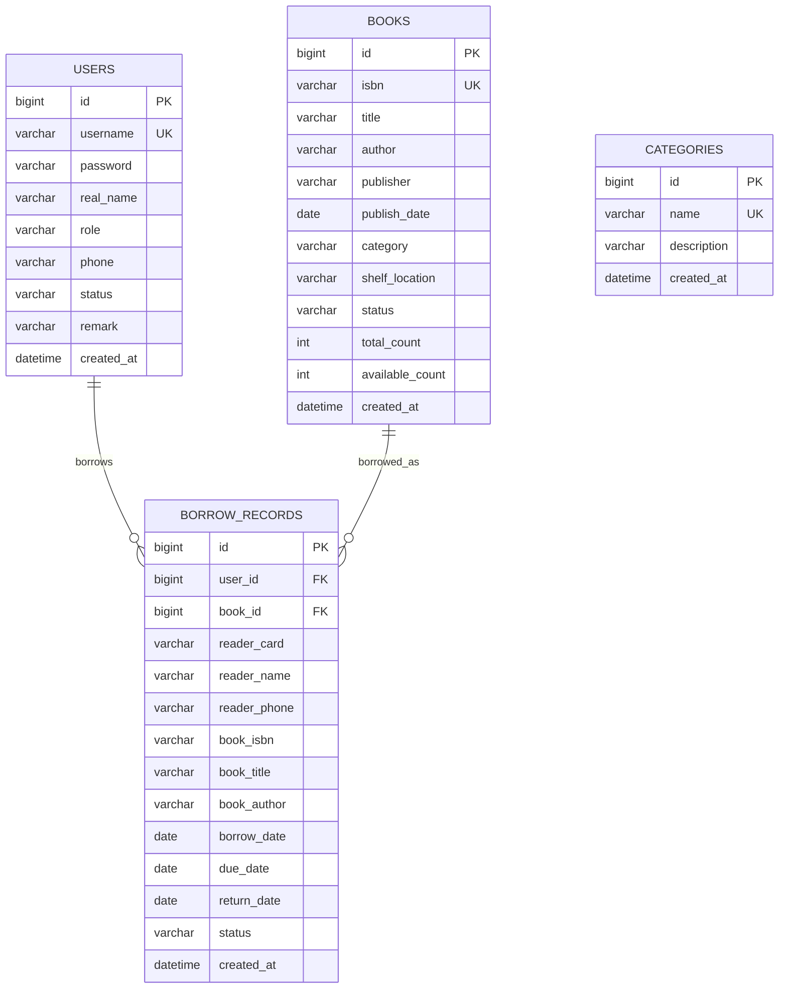
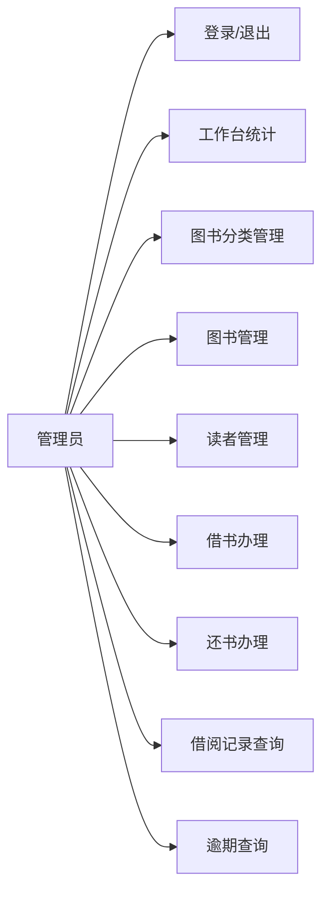
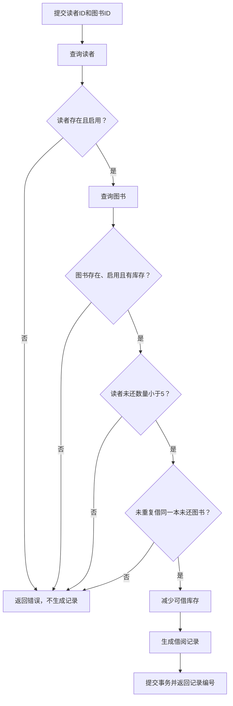
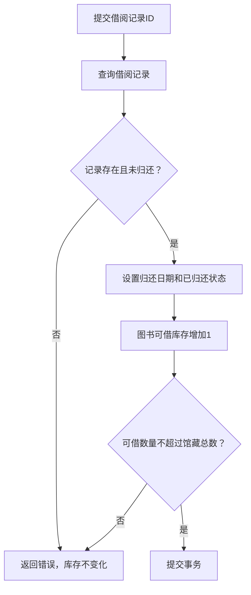

# 图书馆借阅系统设计说明

## 默认管理员账号

```text
账号：admin
密码：123456
```

## ER 图



## 用例图



## 借书流程



## 还书流程



## 接口清单

```text
POST   /auth/login
POST   /auth/logout
GET    /auth/me

GET    /dashboard

GET    /categories
GET    /categories?page=0&size=10&keyword=计算机
GET    /categories/{id}
POST   /categories
PUT    /categories/{id}
DELETE /categories/{id}

GET    /books
GET    /books?page=0&size=10&keyword=Java&category=计算机&status=enabled
GET    /books/{id}
POST   /books
PUT    /books/{id}
PUT    /books/{id}/disable
PUT    /books/{id}/enable
DELETE /books/{id}

GET    /readers
GET    /readers?page=0&size=10&keyword=张三&status=enabled
GET    /readers/{id}
POST   /readers
PUT    /readers/{id}
PUT    /readers/{id}/disable
PUT    /readers/{id}/enable

GET    /borrow/records
GET    /borrow/records?page=0&size=10&status=borrowed&userId=2&bookId=1
GET    /borrow/records/{id}
GET    /borrow/overdue
POST   /borrow?userId=2&bookId=1
POST   /borrow/return/{recordId}
```

## 业务规则实现说明

- ISBN 使用唯一校验。
- 借阅证号使用 `users.username`，并进行唯一校验。
- `books.total_count` 表示馆藏总数，`books.available_count` 表示可借数量。
- 借书和还书方法使用 `@Transactional`，保证记录和库存一起成功或一起失败。
- 借阅记录保存读者证号、读者姓名、手机号、ISBN、书名和作者快照，避免后续资料修改影响历史记录展示。
- 除首页和 `/auth/**` 外，后台接口需要登录后访问。
- `users.status=disabled` 的读者不能新借书。
- `books.status=disabled` 的图书不能新借书，但未还记录仍可归还。
- 同一读者最多 5 本未还。
- 同一读者不能重复借同一本未归还图书。
- 当前日期超过 `due_date` 且状态仍为 `borrowed` 时，会出现在逾期查询中。
